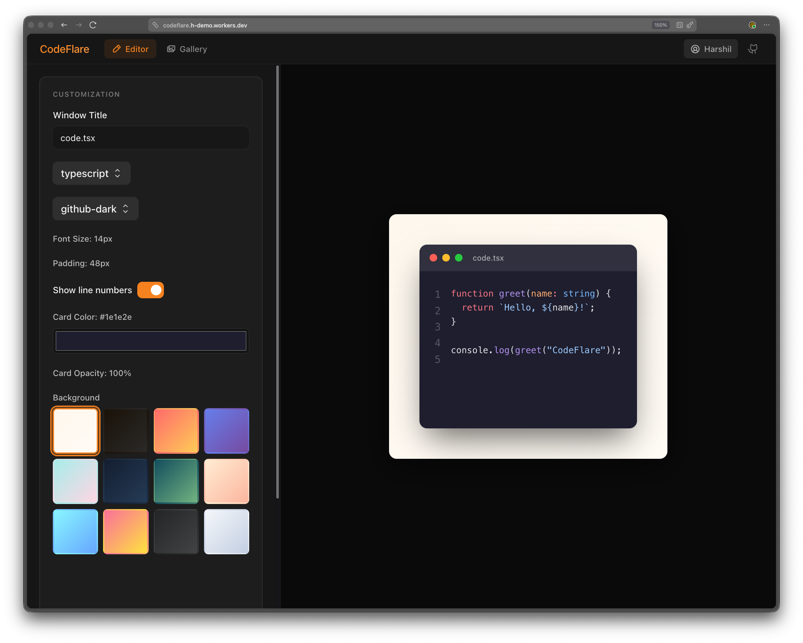

# CodeFlare

Generate beautiful, shareable code screenshots — powered by Cloudflare Workers.

Paste your code, customize the styling, and export a pixel-perfect PNG rendered by a headless browser at 2× device pixel ratio. Authenticated users can save screenshots to Cloudflare R2, browse their gallery, and search across saved screenshots using AI.

[](https://deploy.workers.cloudflare.com/?url=https://github.com/harshil1712/codeflare)

<!-- Add a screenshot or demo GIF here -->


---

## Features

- **Live preview** — real-time syntax-highlighted preview as you type
- **20 languages** — TypeScript, JavaScript, Python, Rust, Go, Java, C, C++, C#, HTML, CSS, JSON, YAML, Markdown, Bash, SQL, PHP, Ruby, and more
- **10 themes** — GitHub Dark/Light, One Dark Pro, Dracula, Nord, Monokai, Solarized Dark/Light, Catppuccin Mocha, Vitesse Dark
- **13 background presets** — gradients from Sunset to Midnight, plus transparent
- **Configurable styling** — font size, padding, card background color and opacity, line numbers, window title
- **Server-side PNG rendering** — Puppeteer via Cloudflare Browser Rendering at 2× DPI
- **Flexible export** — download only, save to R2, or save and download
- **Authentication** — email/password sign-up and sign-in via Better Auth, backed by Cloudflare D1
- **Screenshot gallery** — authenticated users can browse, preview, and delete their saved screenshots
- **AI-powered search** — semantic search across saved screenshots using Cloudflare AutoRAG
- **Rate limiting** — 10 requests per 60 seconds per IP

---

## Tech Stack

| Layer               | Technology                                |
| ------------------- | ----------------------------------------- |
| Frontend            | React 19, TypeScript, Vite + SWC          |
| Routing             | TanStack Router                           |
| Syntax highlighting | Shiki (frontend preview + worker render)  |
| UI components       | @cloudflare/kumo, @phosphor-icons/react   |
| Code editor         | react-simple-code-editor                  |
| Authentication      | Better Auth                               |
| Database            | Cloudflare D1 (SQLite) via Drizzle ORM    |
| Backend             | Hono 4 on Cloudflare Workers              |
| Screenshot engine   | @cloudflare/puppeteer (Browser Rendering) |
| Storage             | Cloudflare R2                             |
| AI search           | Cloudflare AutoRAG                        |
| Rate limiting       | Cloudflare Rate Limiting binding          |
| Deployment          | Cloudflare Pages + Workers (Wrangler)     |

---

## Supported Languages

| Language   | Language   | Language | Language |
| ---------- | ---------- | -------- | -------- |
| TypeScript | JavaScript | TSX      | JSX      |
| Python     | Rust       | Go       | Java     |
| C          | C++        | C#       | HTML     |
| CSS        | JSON       | YAML     | Markdown |
| Bash       | SQL        | PHP      | Ruby     |

---

## Local Development

### Prerequisites

- Node.js 18+
- A Cloudflare account with Workers, R2, D1, Browser Rendering, and AI access
- Wrangler CLI (`npm install -g wrangler` or use the local dev dependency)

### Setup

```bash
git clone https://github.com/harshil1712/codeflare
cd codeflare
npm install
```

Copy the example environment file and fill in your values (see [Environment Variables](#environment-variables)):

```bash
cp .env.example .env
```

### Run the dev server

```bash
npm run dev
```

This starts the Vite dev server at `http://localhost:5173` with HMR. The frontend and worker are bundled together via the `@cloudflare/vite-plugin`.

### Notes on Cloudflare bindings in development

The worker uses five Cloudflare bindings (`BROWSER`, `SCREENSHOTS`, `RATE_LIMITER`, `AI`, `DB`). In local development these are provided by Wrangler's local simulation, with one exception:

- `BROWSER` is configured with `"remote": true` in `wrangler.jsonc`, so screenshot generation makes live calls to Cloudflare's Browser Rendering service during dev.
- `SCREENSHOTS` (R2), `RATE_LIMITER`, `DB` (D1), and `AI` are simulated locally by Wrangler.

You must be logged in to Wrangler for remote bindings to work:

```bash
npx wrangler login
```

---

## Database Setup

CodeFlare uses Cloudflare D1 for authentication data (users, sessions, accounts). Migrations are managed with Drizzle ORM.

### Apply migrations locally

```bash
npm run db:migrate
```

### Regenerate migrations after schema changes

```bash
npm run db:generate
```

### Regenerate the Better Auth schema

If you modify authentication options in `lib/auth.ts`, regenerate the auth schema:

```bash
npm run auth:generate
```

---

## Environment Variables

The following secrets are required. Set them in a `.env` file for local development, and as Wrangler secrets for production.

| Variable                 | Description                                                                   |
| ------------------------ | ----------------------------------------------------------------------------- |
| `BETTER_AUTH_SECRET`     | Random secret used to sign auth tokens (min 32 chars)                         |
| `BETTER_AUTH_URL`        | The canonical URL of your deployed app (e.g. `https://codeflare.example.com`) |
| `CLOUDFLARE_ACCOUNT_ID`  | Your Cloudflare account ID (for D1 HTTP access via Drizzle)                   |
| `CLOUDFLARE_DATABASE_ID` | The D1 database ID from `wrangler.jsonc`                                      |
| `CLOUDFLARE_D1_TOKEN`    | A Cloudflare API token with D1 read/write permissions                         |

To add secrets to your deployed worker:

```bash
npx wrangler secret put BETTER_AUTH_SECRET
npx wrangler secret put BETTER_AUTH_URL
# etc.
```

---

## Deployment

### 1. Create Cloudflare resources

Before deploying, ensure the following exist in your Cloudflare account:

**R2 Bucket**
```bash
npx wrangler r2 bucket create codeflare-screenshots
```

**D1 Database**
```bash
npx wrangler d1 create codeflare
```

Update the `database_id` in `wrangler.jsonc` with the ID returned by this command, then apply migrations to production:

```bash
npx wrangler d1 migrations apply DB --remote
```

**Rate Limiting namespace** — configured in `wrangler.jsonc` under `ratelimits`. The `namespace_id` must match a rate limit namespace in your account. Update `wrangler.jsonc` with the correct ID if needed.

**Browser Rendering** — enabled automatically for your account; no manual creation required.

**AutoRAG** — create an AutoRAG instance named `codeflare-search` in the Cloudflare dashboard (AI > AutoRAG), then ensure the `AI` binding in `wrangler.jsonc` points to your account's AI gateway.

### 2. Set secrets

```bash
npx wrangler secret put BETTER_AUTH_SECRET
npx wrangler secret put BETTER_AUTH_URL
npx wrangler secret put CLOUDFLARE_ACCOUNT_ID
npx wrangler secret put CLOUDFLARE_DATABASE_ID
npx wrangler secret put CLOUDFLARE_D1_TOKEN
```

### 3. Deploy

```bash
npm run deploy
```

This runs `tsc -b` (type-check), `vite build` (bundle frontend + worker), then `wrangler deploy` to push everything to Cloudflare.

### Wrangler bindings reference (`wrangler.jsonc`)

| Binding        | Type              | Details                       |
| -------------- | ----------------- | ----------------------------- |
| `BROWSER`      | Browser Rendering | `remote: true`                |
| `SCREENSHOTS`  | R2 Bucket         | `codeflare-screenshots`       |
| `RATE_LIMITER` | Rate Limit        | 10 req / 60 s per IP          |
| `AI`           | AI binding        | Used for AutoRAG search       |
| `DB`           | D1 Database       | `codeflare` (auth + app data) |

After any changes to `wrangler.jsonc`, regenerate the Worker type definitions:

```bash
npm run cf-typegen
```

---

## Routes

| Path        | Description                                   | Auth required |
| ----------- | --------------------------------------------- | ------------- |
| `/`         | Main code editor and screenshot export        | No            |
| `/gallery`  | Browse, preview, and delete saved screenshots | Yes           |
| `/login`    | Email/password sign-in                        | No            |
| `/register` | Create a new account                          | No            |

---

## API Reference

### `POST /api/screenshot`

Generates a PNG screenshot of the provided code.

**Request body** (`application/json`):

| Field             | Type      | Required | Description                                                                    |
| ----------------- | --------- | -------- | ------------------------------------------------------------------------------ |
| `code`            | `string`  | Yes      | The source code to render (max 50 KB)                                          |
| `language`        | `string`  | Yes      | Programming language for syntax highlighting (e.g. `"typescript"`, `"python"`) |
| `theme`           | `string`  | Yes      | Shiki theme ID (see [Themes](#themes-theme-field))                             |
| `background`      | `string`  | Yes      | CSS gradient string for the outer background                                   |
| `padding`         | `number`  | Yes      | Padding (px) around the code card                                              |
| `fontSize`        | `number`  | Yes      | Font size (px) for the code                                                    |
| `showLineNumbers` | `boolean` | Yes      | Whether to render line numbers                                                 |
| `windowTitle`     | `string`  | Yes      | Title shown in the macOS-style window title bar                                |
| `cardBackground`  | `string`  | Yes      | CSS color value for the code card background                                   |
| `action`          | `string`  | Yes      | Export action: `"download_only"`, `"r2_only"`, or `"r2_and_download"`          |

**Responses:**

| Scenario                             | Status | Body                                 |
| ------------------------------------ | ------ | ------------------------------------ |
| `download_only` or `r2_and_download` | `200`  | PNG binary (`image/png`)             |
| `r2_only`                            | `200`  | `{ "key": "<r2-object-key>" }`       |
| Validation error                     | `400`  | `{ "error": "<message>" }`           |
| Rate limit exceeded                  | `429`  | `{ "error": "Rate limit exceeded" }` |
| Server error                         | `500`  | `{ "error": "<message>" }`           |

**Example:**

```bash
curl -X POST https://<your-worker>.workers.dev/api/screenshot \
  -H "Content-Type: application/json" \
  -d '{
    "code": "const hello = \"world\";",
    "language": "typescript",
    "theme": "github-dark",
    "background": "linear-gradient(135deg, #141e30 0%, #243b55 100%)",
    "padding": 40,
    "fontSize": 14,
    "showLineNumbers": true,
    "windowTitle": "hello.ts",
    "cardBackground": "rgba(30,30,30,0.85)",
    "action": "download_only"
  }' --output screenshot.png
```

---

### `GET /api/screenshots`

Returns a list of screenshots saved by the authenticated user.

**Auth:** Required (session cookie)

**Response** (`200`):

```json
[
  {
    "key": "user_abc123/2026-03-01T12:00:00Z_uuid.png",
    "uploaded": "2026-03-01T12:00:00.000Z",
    "size": 204800
  }
]
```

---

### `GET /api/screenshots/:key`

Serves a specific saved screenshot as a PNG.

**Auth:** Required (must be the owner)

**Response:** PNG binary (`image/png`) or `404` / `403`.

---

### `DELETE /api/screenshots/:key`

Deletes a saved screenshot from R2.

**Auth:** Required (must be the owner)

**Response:** `200 { "success": true }` or `404` / `403`.

---

### `GET /api/search?q=<query>`

Searches saved screenshots using Cloudflare AutoRAG.

**Auth:** Required (session cookie)

**Query params:**

| Param | Description                   |
| ----- | ----------------------------- |
| `q`   | Natural language search query |

**Response** (`200`): AutoRAG search result object.

---

### `POST /api/auth/*` · `GET /api/auth/*`

Better Auth handler for sign-up, sign-in, sign-out, and session management. Refer to the [Better Auth documentation](https://www.better-auth.com) for the full sub-route reference.

---

## Configuration Reference

### Themes (`theme` field)

| ID                 | Name             |
| ------------------ | ---------------- |
| `github-dark`      | GitHub Dark      |
| `github-light`     | GitHub Light     |
| `one-dark-pro`     | One Dark Pro     |
| `dracula`          | Dracula          |
| `nord`             | Nord             |
| `monokai`          | Monokai          |
| `solarized-dark`   | Solarized Dark   |
| `solarized-light`  | Solarized Light  |
| `catppuccin-mocha` | Catppuccin Mocha |
| `vitesse-dark`     | Vitesse Dark     |

### Background presets

| Name             | Description         |
| ---------------- | ------------------- |
| Cloudflare Light | Warm white gradient |
| Cloudflare Dark  | Dark warm gradient  |
| Sunset           | Red to yellow       |
| Ocean            | Blue to purple      |
| Purple Haze      | Aqua to pink        |
| Midnight         | Deep navy           |
| Forest           | Teal to green       |
| Peach            | Warm peach tones    |
| Sky              | Cyan to blue        |
| Candy            | Pink to yellow      |
| Dark             | Near-black grey     |
| Light            | Soft grey-white     |
| Transparent      | No background       |

### Export actions (`action` field)

| Value             | Behavior                                         |
| ----------------- | ------------------------------------------------ |
| `download_only`   | Returns PNG directly in the response body        |
| `r2_only`         | Saves PNG to R2; returns `{ "key": "..." }`      |
| `r2_and_download` | Saves to R2 and returns PNG in the response body |

---

## Contributing

Contributions are welcome.

1. Fork the repository and create a feature branch
2. Make your changes, following the code style in `AGENTS.md`
3. Run lint and build before opening a PR:
   ```bash
   npm run lint
   npm run build
   ```
4. Open a pull request with a clear description of what changed and why

**Note:** There is no test framework configured. Type correctness (`tsc -b`) and linting (`eslint .`) are the primary automated checks.

---

## License

[MIT](./LICENSE) — Copyright (c) 2026 Harshil Agrawal
